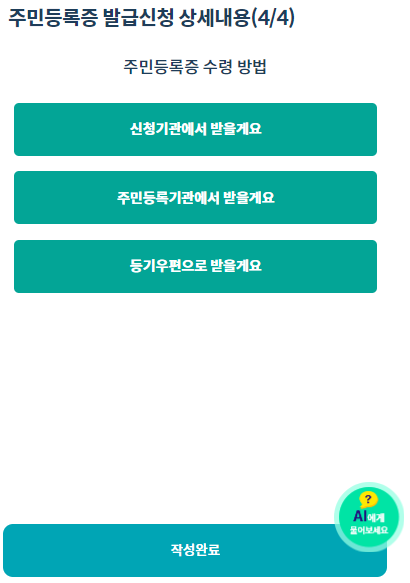

# 3. 주민등록 전입세대 열람 신청

### 1. 서식선택

홈 화면에서 주민등록 전입세대 열람 신청 서식을 선택해주세요.

### 2. 유형선택

홈 화면에서 주민등록 전입세대 열람 신청 서식을 선택해주세요.

.png>)

### 3. 소유주 확인

해당 건물의 소유주 정보를 선택합니다.


발급 대상자가 아니면 민원을 신청할 수 없습니다.


### 4. 유의사항 확인 및 동의

유의사항을 하나씩 확인하고 네 또는 확인 버튼을 눌러 동의해주세요

.png>)

### 5. 인증하기

휴대폰 인증 또는 모바일 신분증을 선택해 인증을 완료합니다.

.png>)

### 6. 신청인 정보 확인 

본인인증을 통해 자동으로 입력된 정보를 확인하고 맞으면 서명  **다음** 버튼을 눌러 진행합니다.

### 7. 건물 정보 입력

열람 대상 물건 소재지 정보를 입력합니다

### 8. 행정정보 공동이용 동의서(소유자)

동의서를 확인하고 서명 후 **확인** 버튼을 눌러 진행합니다.

>)

### 9. 완료하기

작성 완료 버튼을 눌러 서류 작성을 끝냅니다.

.png>)

